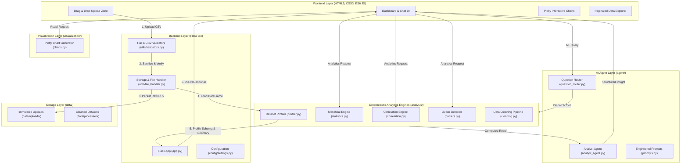

# 🤖 AI Data Analyst Agent

[](https://www.python.org/)
[](https://flask.palletsprojects.com/)
[](https://pandas.pydata.org/)
[](https://plotly.com/)
[](LICENSE)

An enterprise-grade, portfolio-ready **AI Data Analyst Agent** web application. It transforms raw, arbitrary CSV datasets into comprehensive exploratory data analysis (EDA), data quality audits, parametric/non-parametric statistics, interactive Plotly visualizations, automated data cleaning pipelines, and natural-language AI insights with strict deterministic grounding.

---

## 📌 Table of Contents

- [Key Highlights](#-key-highlights)
- [System Architecture](#-system-architecture)
- [Directory Structure](#-directory-structure)
- [Technology Stack](#-technology-stack)
- [Development Principles](#-development-principles)
- [Phased Implementation Roadmap](#-phased-implementation-roadmap)
- [Installation & Setup](#-installation--setup)
- [Running the Application](#-running-the-application)
- [API Reference (Phase 1)](#-api-reference-phase-1)
- [Testing & Quality Assurance](#-testing--quality-assurance)

---

## 🌟 Key Highlights

1. **Deterministic Core vs. AI Reasoning Layer**: All calculations (quantiles, IQR, correlations, skewness, missingness, isolation forests) are strictly computed by Python, Pandas, SciPy, and Scikit-learn. The LLM acts as an analytical synthesizer, answering user questions and highlighting insights without fabricating numbers.
2. **Dataset Immutability**: Uploaded raw datasets are treated as strictly immutable read-only records in `data/uploads/`. Cleaned and transformed versions are maintained separately in `data/processed/`.
3. **Generic & Dynamic Schema Inference**: Works with arbitrary CSV files. Automatically detects numerical, categorical, datetime, boolean, ID/high-cardinality, and text columns without hardcoded column names or assumptions about specific datasets (Titanic, Superstore, Iris, etc.).
4. **Resilient Ingestion**: Automatic delimiter detection (`,`, `;`, `\t`, `|`), multi-encoding fallback (`utf-8`, `latin-1`, `cp1252`, `iso-8859-1`), secure filename generation, and size limit validations.
5. **Modern Analytics Dashboard**: Dark-mode glassmorphic UI, responsive metric KPI cards, dynamic column chips, and an interactive data explorer.

---

## 🏛 System Architecture



---

## 📁 Directory Structure

```
AI-Data-Analyst-Agent/
│
├── app.py                      # Flask application factory, routes & API endpoints
├── requirements.txt            # Project dependencies
├── README.md                   # Complete architectural & operational documentation
├── .env.example                # Environment variable configuration template
├── .gitignore                  # Git exclusions (credentials, cache, upload data)
│
├── config/
│   └── settings.py             # Centralized application settings & env loader
│
├── data/
│   ├── uploads/                # Immutable raw CSV files (read-only)
│   └── processed/              # Cleaned / transformed datasets
│
├── analysis/                   # Deterministic Data Analysis Engines
│   ├── __init__.py
│   ├── profiler.py             # Schema detection, data shape, missingness, memory
│   ├── cleaning.py             # (Phase 4) Deduplication, imputation, type casting
│   ├── statistics.py           # (Phase 2) Parametric & non-parametric statistics
│   ├── correlation.py          # (Phase 3) Pearson, Spearman, Cramér's V
│   └── outliers.py             # (Phase 3) IQR, Z-Score, Isolation Forest
│
├── visualization/              # Dynamic Chart Generation
│   ├── __init__.py
│   └── charts.py               # (Phase 3) Plotly JSON chart specifications
│
├── agent/                      # AI Agent & Natural Language Interface
│   ├── __init__.py
│   ├── analyst_agent.py        # (Phase 5) LLM agent with deterministic tool binding
│   ├── question_router.py      # (Phase 5) Intent classification & tool dispatching
│   └── prompts.py              # (Phase 5) Analytical prompt templates
│
├── reports/                    # Automated Reporting
│   └── report_generator.py     # (Phase 5) Markdown / HTML / PDF executive reports
│
├── utils/                      # Utilities & Helpers
│   ├── __init__.py
│   ├── file_handler.py         # File persistence, encoding/delimiter detection
│   └── validators.py           # File validation, MIME check, structural sanity
│
├── templates/                  # Jinja2 HTML Templates
│   ├── index.html              # Landing page & CSV upload dropzone
│   ├── dashboard.html          # Analytics dashboard & dataset explorer
│   └── chat.html               # Natural language AI analyst conversational view
│
├── static/                     # Static Assets
│   ├── css/
│   │   └── style.css           # Modern dark-mode glassmorphic design system
│   └── js/
│       ├── main.js             # Upload handling, toast notifications, UI controls
│       └── dashboard.js        # Dataset explorer, column chips, pagination
│
└── tests/                      # Automated Unit & Integration Test Suite
    └── test_basic.py           # Foundation, validator, profiler & route tests
```

---

## 🛠 Technology Stack

| Domain | Technology | Purpose |
| :--- | :--- | :--- |
| **Backend Web Framework** | Python 3.10+ & Flask 3.0+ | Lightweight, modular REST API and routing |
| **Data Manipulation & Analysis** | Pandas 2.0+, NumPy 1.24+ | In-memory tabular processing, vector math |
| **Statistical Modeling & ML** | SciPy 1.11+, Scikit-learn 1.3+ | Hypothesis testing, distribution fitting, outlier detection |
| **Interactive Visualizations** | Plotly 5.18+ | Client-side interactive charts and heatmaps |
| **Frontend Dashboard** | HTML5, Modern CSS3, Vanilla ES6 JS | Fast, glassmorphic dark-mode analytics dashboard |
| **AI / LLM Integration** | Google Gemini API / OpenAI API | Analytical synthesis, tool calling, report drafting |
| **Testing** | Pytest, Requests | Automated unit and integration testing |

---

## 🎯 Development Principles

1. **Incremental Milestones**: Each phase implements a self-contained, fully testable layer before advancing.
2. **Deterministic Computation**: Python/Pandas calculates statistical values; the LLM never invents numbers.
3. **Data Integrity**: Original uploaded files are never overwritten or altered.
4. **Schema Agnostic**: Zero hardcoded columns; dynamic detection across arbitrary tabular structures.
5. **Defensive Security**: Safe file names, file size caps, extension checks, and sanitized inputs.

---

## 🗺 Phased Implementation Roadmap

- [x] **Phase 1: Project Foundation & Architecture** *(Current Phase)*
  - [x] Modular project scaffolding & package structure.
  - [x] Settings management with `.env` and `config/settings.py`.
  - [x] Secure file upload handler with multi-encoding fallback and delimiter sniffing.
  - [x] Core dataset profiler (schema inference, missingness, duplicates, memory footprint).
  - [x] Flask REST API (`/api/upload`, `/api/datasets`, `/api/profile/<filename>`, `/api/preview/<filename>`).
  - [x] Modern dark-mode dashboard UI with drag-and-drop upload and data explorer.
  - [x] Unit test suite for Phase 1 components.
- [ ] **Phase 2: Deep Statistical Analysis & Data Quality Grading**
  - [ ] Descriptive statistics (Mean, Median, Std, IQR, Skewness, Kurtosis, Quantiles).
  - [ ] Categorical frequency distributions and cardinality profiling.
  - [ ] Automated Data Quality Score (0-100) and Health Grade (A-F).
- [ ] **Phase 3: Correlation Analysis, Outlier Detection & Plotly Visualizations**
  - [ ] Numerical and categorical correlation engines (Pearson, Spearman, Cramér's V).
  - [ ] Outlier detection algorithms (IQR, Z-Score, Isolation Forest).
  - [ ] Interactive Plotly chart builders (distributions, heatmaps, box plots, scatter matrices).
- [ ] **Phase 4: Automated Data Cleaning Engine & Dataset Export**
  - [ ] Cleaning rule recommendation engine (smart missing value imputation, deduplication, type casting).
  - [ ] Non-destructive transformation pipeline generating cleaned datasets in `data/processed/`.
  - [ ] Cleaned dataset download in CSV and Excel formats.
- [ ] **Phase 5: AI Agent Integration, NL Querying & Automated Reports**
  - [ ] Tool-augmented AI Agent with deterministic tool calling.
  - [ ] Natural-language Q&A interface for dataset inquiries.
  - [ ] Executive business insights generator and exportable analytical reports (Markdown/HTML/PDF).
- [ ] **Phase 6: Optimization, Hardening & Portfolio Polish**
  - [ ] Performance caching for large datasets.
  - [ ] End-to-end integration tests and recruiter-ready demo showcase datasets.

---

## 🚀 Installation & Setup

### Prerequisites
- Python 3.10 or higher
- pip package manager

### 1. Clone or Navigate to the Repository
```bash
cd AI-Data-Analyst-Agent
```

### 2. Create and Activate a Virtual Environment
```bash
# Windows (PowerShell)
python -m venv venv
.\venv\Scripts\Activate.ps1

# Linux / macOS
python3 -m venv venv
source venv/bin/activate
```

### 3. Install Dependencies
```bash
pip install -r requirements.txt
```

### 4. Configure Environment Variables
Copy `.env.example` to `.env` and adjust configuration if needed:
```bash
cp .env.example .env
```

---

## 🖥 Running the Application

Start the Flask development server:
```bash
python app.py
```

The application will be accessible at:
👉 **`http://127.0.0.1:5000`**

### Available Pages:
- **`http://127.0.0.1:5000/`** - Home & CSV Upload Zone
- **`http://127.0.0.1:5000/dashboard`** - Analytics Dashboard & Data Explorer
- **`http://127.0.0.1:5000/chat`** - AI Agent Conversational Interface

---

## 📡 API Reference (Phase 1)

| Endpoint | Method | Description |
| :--- | :--- | :--- |
| `/api/health` | `GET` | System health check and status |
| `/api/upload` | `POST` | Upload and validate a new CSV dataset |
| `/api/datasets` | `GET` | List all available uploaded datasets |
| `/api/profile/<filename>` | `GET` | Retrieve metadata profile & schema for a dataset |
| `/api/preview/<filename>` | `GET` | Retrieve paginated rows for tabular inspection |
| `/api/sample/<name>` | `POST` | Load bundled sample dataset (e.g. Sales, Employees) |

---

## 🧪 Testing & Quality Assurance

Run the automated test suite with `pytest`:
```bash
pytest -v tests/
```
